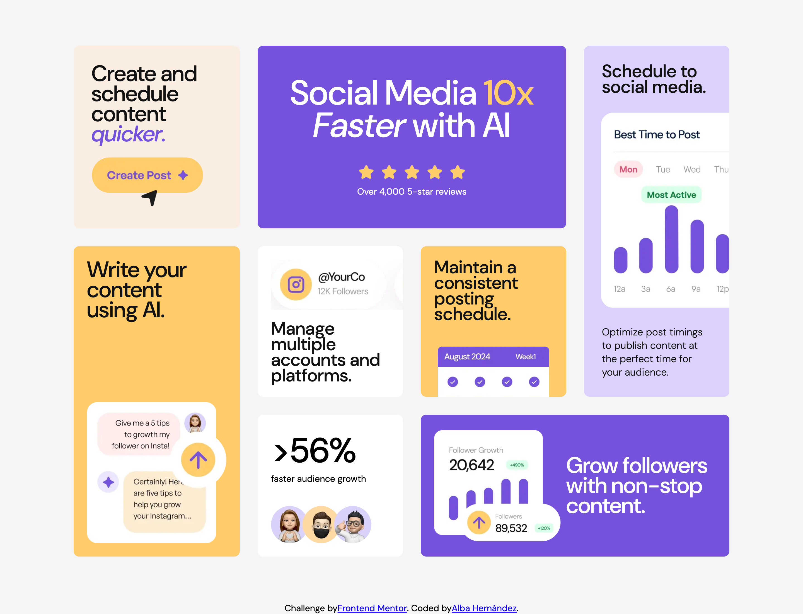

# Frontend Mentor - Bento grid

This is a solution to the [Bento grid challenge on Frontend Mentor](https://www.frontendmentor.io/challenges/bento-grid-RMydElrlOj). Frontend Mentor challenges help you improve your coding skills by building realistic projects.

## 🛜 Live

- Live URL: [Visita](https://albahdezs.github.io/bento-grid/)

## 🎆 Imágenes

- Versión móvil 

- Versión tablet

- Versión ordenador

### 🏗️ Construido con

- Semantic HTML5 markup
- CSS custom properties
- Flexbox
- CSS Grid
- Mobile-first workflow

## 👩🏻‍💻 Autor

- Website - [Alba Hernández](https://albahernandez.dev/)
- Frontend Mentor - [@Albahdezs](https://www.frontendmentor.io/profile/Albahdezs)
- LinkedIn - [Alba Hernández Serrano](https://www.linkedin.com/in/alba-hern%C3%A1ndez-serrano/)
